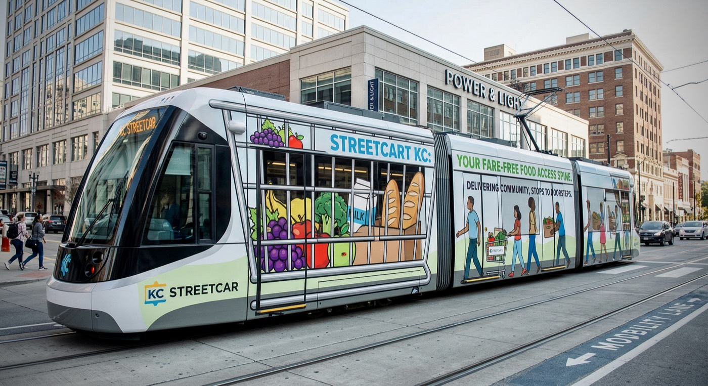

# StreetCart KC



StreetCart KC is AICodex's final 2026 AI Prompt Championship submission set across all three tracks. The concept is a streetcar-led, partner-operated food-access pilot for Kansas City: the streetcar corridor is the visible civic spine, while pantry and nonprofit partners handle neighborhood fulfillment into priority ZIP codes.

[](https://ai-prompt-kc-2026.vercel.app/)
[](https://www.youtube.com/watch?v=AE5dciNphNA)
[](https://streetcart-kc-434237915842.us-west1.run.app/)
[](https://linkedin.com/in/danielpgreen)
[](https://www.aicollective.com/chapters/kc)

Quick links: [Oracle](https://ai-prompt-kc-2026.vercel.app/) | [Muse](https://www.youtube.com/watch?v=AE5dciNphNA) | [Architect](https://streetcart-kc-434237915842.us-west1.run.app/) | [LinkedIn](https://linkedin.com/in/danielpgreen) | [AI Collective KC](https://www.aicollective.com/chapters/kc)

## Final Submissions

- Oracle: [StreetCart KC submission site](https://ai-prompt-kc-2026.vercel.app/) plus the packaged deck artifact in `StreetCart_KC_Rail_to_Lifeline.pdf`
- Muse: [The Fight for Food in KC](https://www.youtube.com/watch?v=AE5dciNphNA) plus the local export in `The_Fight_for_Food_in_KC.mp4`
- Architect: [Live StreetCart prototype](https://streetcart-kc-434237915842.us-west1.run.app/) backed by the static and tracker proofs in this repo

Built by [Daniel Green](https://linkedin.com/in/danielpgreen) with the [AI Collective Kansas City chapter](https://www.aicollective.com/chapters/kc).

This repo is not a production application. It is a competition package plus a thin interactive proof:

- Oracle: business case, pilot logic, economics, and deck
- Muse: brand, narrative, and creative system
- Architect: lightweight web proofs that make the concept feel concrete

## Current State

As of `2026-03-28`, the repository has:

- A live Oracle submission at `https://ai-prompt-kc-2026.vercel.app/`
- A published Muse film at `https://www.youtube.com/watch?v=AE5dciNphNA`
- A live Architect prototype at `https://streetcart-kc-434237915842.us-west1.run.app/`
- A static StreetCart landing/proof page at `index.html`
- A React/Vite tracker proof at `tracker.html`
- A packaged Oracle PDF at `StreetCart_KC_Rail_to_Lifeline.pdf`
- A local Muse export at `The_Fight_for_Food_in_KC.mp4`
- Shared structured data for the deck and static proof in `data/streetcart-kc.json`
- A generated tracker dataset in `data/kc-streetcar-tracker.json`
- A KC Streetcar arrivals fetcher plus normalized snapshot under `docs/reference/kc-streetcar/arrivals/`
- Research, reference, and worklog material showing how the concept was developed

What this repo does not have yet:

- A Next.js application scaffold
- A backend service
- Postgres
- SMS delivery
- A lint workflow

## Inventory

### Root docs

- `AGENTS.md`: repo operating rules
- `README.md`: repo handbook
- `MASTER_DOC.md`: implementation and product handoff
- `BRAND.md`: brand and creative guidance
- `DESIGN.md`: design direction and UI guidance

### Active product and engineering docs

- `docs/product/kc-streetcar-food-access-tracker-prd.md`
- `docs/product/kc-streetcar-food-access-tracker-user-stories.md`
- `docs/engineering/test-strategy.md`
- `docs/logs/2026-03-28-worklog.md`
- `docs/logs/README.md`

### Competition and research materials

- `docs/research/`: supporting research artifacts and sourced exploration
- `docs/archive/`: archived competition-planning material that is no longer the active source of truth

### Reference bundle

- `docs/reference/kc-streetcar/README.md`: guide to the KC Streetcar reference corpus
- `docs/reference/kc-streetcar/arrivals/`: normalized live-signage endpoint inventory and latest snapshot
- `docs/reference/kc-streetcar/downloads/`: downloaded public PDFs/images used as source material
- `docs/reference/kc-streetcar/manifests/`: crawl manifests and snapshot indices
- `docs/reference/kc-streetcar/pages/` and `docs/reference/kc-streetcar/posts/`: scraped page and post snapshots

Note: `docs/reference/kc-streetcar/videos/` is intentionally kept local and ignored from Git because the raw media set is large and not needed for the tracked repo.

### Data and generated artifacts

- `data/streetcart-kc.json`: shared concept facts used by the deck and static proof
- `data/kc-streetcar-tracker.json`: generated route/stop/food-access dataset for the tracker
- `docs/archive/legacy/2026-03-28-competition-package/plans/StreetCart_KC_Oracle.pptx`: generated Oracle source deck
- `StreetCart_KC_Rail_to_Lifeline.pdf`: packaged Oracle final deck
- `The_Fight_for_Food_in_KC.mp4`: local Muse export

### App and site files

- `index.html`: static StreetCart proof entrypoint
- `tracker.html`: React tracker entrypoint
- `site/`: static landing-page assets
- `src/tracker/`: React tracker UI
- `src/lib/tracker.js`: tracker helper logic
- `src/lib/streetcart-dashboard.js`: StreetCart dashboard helper logic

### Scripts

- `scripts/build_oracle_deck.mjs`: rebuilds the Oracle deck from source data
- `scripts/build_streetcar_tracker_data.mjs`: rebuilds the tracker dataset
- `scripts/fetch_kc_streetcar_arrivals.mjs`: fetches and normalizes public KC Streetcar arrival data
- `scripts/fetch_kc_streetcar_arrivals.test.mjs`: arrivals-fetcher tests
- `scripts/streetcart_data_contract.test.mjs`: source data contract tests

## Repo Map

```text
.
├── AGENTS.md
├── BRAND.md
├── DESIGN.md
├── MASTER_DOC.md
├── README.md
├── data/
├── docs/
│   ├── archive/
│   ├── engineering/
│   ├── logs/
│   ├── product/
│   ├── reference/
│   └── research/
├── scripts/
├── site/
├── src/
│   ├── lib/
│   └── tracker/
├── index.html
├── tracker.html
├── kc-streetcar-tracker-opus.html
├── package.json
└── vite.config.js
```

## Commands

Install dependencies:

```bash
npm install
```

Current scripts:

```bash
npm run dev
npm run build
npm run preview
npm run site:serve
npm run deck:build
npm run tracker:data
npm run arrivals:fetch
npm run test
npm run test:arrivals
npm run test:tracker
npm run test:dashboard
npm run test:url-state
npm run test:streetcart
```

What they do:

- `npm run dev`: runs the Vite app locally
- `npm run build`: builds the web artifacts into `dist/`
- `npm run preview`: previews the built output
- `npm run site:serve`: serves the repo root directly on `http://127.0.0.1:4173/`
- `npm run deck:build`: regenerates `docs/archive/legacy/2026-03-28-competition-package/plans/StreetCart_KC_Oracle.pptx`
- `npm run tracker:data`: regenerates `data/kc-streetcar-tracker.json`
- `npm run arrivals:fetch`: refreshes `docs/reference/kc-streetcar/arrivals/live-arrivals-latest.json`
- `npm run test`: runs the repo's current test suite

### Current URL entrypoints

- `tracker.html`: exhibit mode
- `tracker.html?mode=stage`: presentation mode
- `tracker.html?zip=66101`: exhibit mode with a selected ZIP deep link
- `index.html?view=resident&lang=en`: landing-page demo state deep link

### Preview deployment

- Preferred deploy target for this repo is a Vercel preview under team `3percentclub-3d65be01`
- Use Vite's default static build output; there is no backend, database, or payment configuration in this repo
- Repo-owned Node baseline is `22.x` (`package.json` engines and `.nvmrc`)
- Preferred Vercel flow for this repo is `vercel build` followed by `vercel deploy --prebuilt --target preview`

## Process

This repo is being run as a disciplined competition package, not as an open-ended product build.

### Working rules

- Start each non-trivial task with success criteria.
- Update the controlling doc before changing dependent artifacts.
- Prefer minimal, reversible changes.
- Keep the streetcar as the public-facing spine, not the freight vehicle.
- Keep phase one partner-operated and operationally believable.
- Record meaningful decisions in the dated worklog.
- Verify outputs before claiming completion.

### Source-of-truth order

When documents disagree, use this order:

1. `AGENTS.md`
2. `MASTER_DOC.md`
3. `BRAND.md`
4. `docs/product/kc-streetcar-food-access-tracker-prd.md`
5. `docs/product/kc-streetcar-food-access-tracker-user-stories.md`
6. `docs/logs/2026-03-28-worklog.md`
7. Archived material in `docs/archive/`

### Typical change flow

1. Write down done criteria.
2. Update the source doc or source data first.
3. Regenerate the affected artifact.
4. Run the relevant tests.
5. Review the affected page, deck, or output locally.
6. Append a checkpoint to `docs/logs/2026-03-28-worklog.md` if the work changes direction, scope, or evidence.
7. Commit and push without deleting local-only reference material.

### Artifact flow

- Deck changes:
  1. Update `data/streetcart-kc.json` or the controlling docs
  2. Run `npm run deck:build`
  3. Review `docs/archive/legacy/2026-03-28-competition-package/plans/StreetCart_KC_Oracle.pptx`

- Tracker changes:
  1. Update tracker docs, source data, or tracker code
  2. Run `npm run tracker:data` if data inputs changed
  3. Run `npm run test:tracker` and `npm run test:dashboard`
  4. Review `tracker.html` locally

- Live arrivals reference refresh:
  1. Run `npm run arrivals:fetch`
  2. Run `npm run test:arrivals`
  3. Review `docs/reference/kc-streetcar/arrivals/live-arrivals-latest.json`

## Verification

The current repo has working `build` and `test` scripts, but no lint command yet.

Baseline verification for most changes:

```bash
npm run test
npm run build
```

For narrower changes, run the specific relevant script instead of pretending broader verification happened.

## Practical Notes

- `dist/`, `node_modules/`, and `tmp/` are local build/runtime directories.
- The raw KC Streetcar video dump is intentionally local-only.
- Research artifacts are evidence. They are not automatically active requirements.
- Archive material is for history and traceability, not day-to-day implementation decisions.

## Next Build Path

The long-term product direction is still:

- Frontend: `Next.js` + `TypeScript`
- Data: `Postgres`
- Messaging: SMS provider

But the current priority is still competition clarity over infrastructure expansion:

1. Keep the static proof, tracker, and deck aligned.
2. Tighten the story, brand, and evidence.
3. Only scaffold the long-term app once the competition package is stable.

## End-Of-Task Retrospective

At the end of a meaningful work block, capture:

- What changed
- What was verified
- What still looks risky
- What the next highest-leverage move is
- What we would do differently next time
